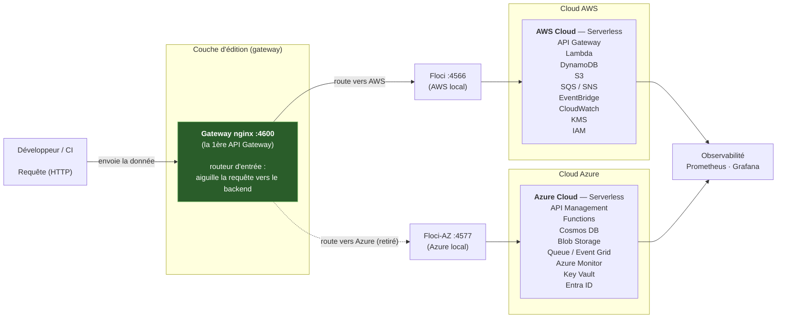
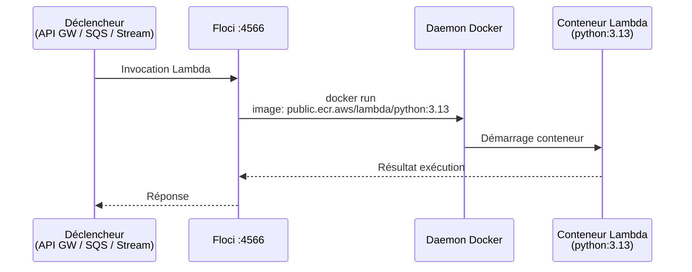
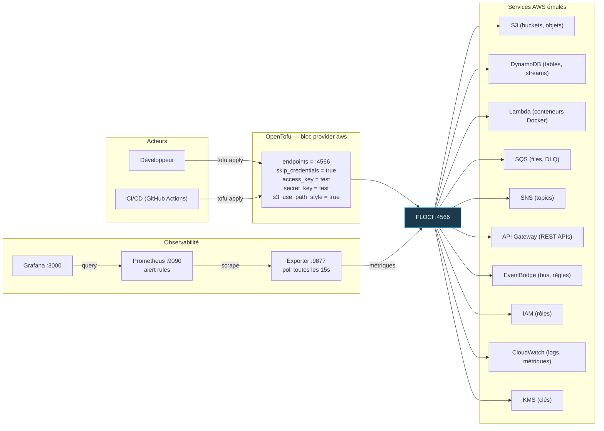

# EXPLICATIONS — Comment fonctionne Floci dans CloudForge

Ce document explique en détail le mécanisme d'émulation AWS locale avec **Floci**,
comment OpenTofu s'y connecte, et les différences exactes par rapport au vrai AWS
et au vrai Azure.

---

## Table des matières

1. [Qu'est-ce que Floci ?](#1-quest-ce-que-floci)
2. [Architecture globale](#2-architecture-globale)
3. [Comment OpenTofu se connecte à Floci (AWS)](#3-comment-opentofu-se-connecte-à-floci-aws)
4. [Comparaison détaillée : Floci vs vrai AWS](#4-comparaison-détaillée--floci-vs-vrai-aws)
5. [Les Lambda dans Floci](#5-les-lambda-dans-floci)
6. [Observabilité locale](#6-observabilité-locale)
7. [Floci-AZ : l'émulation Azure](#7-floci-az-lémulation-azure)
8. [Comparaison détaillée : Floci-AZ vs vrai Azure](#8-comparaison-détaillée--floci-az-vs-vrai-azure)
9. [Divergences connues et limites](#9-divergences-connues-et-limites)
10. [Résumé visuel du flux complet](#10-résumé-visuel-du-flux-complet)

---

## 1. Qu'est-ce que Floci ?

**Floci** est un émulateur local des API AWS. C'est un conteneur Docker qui
implémente les mêmes interfaces HTTP que les vrais services AWS (S3, DynamoDB,
Lambda, SQS, SNS, API Gateway, IAM, CloudWatch, EventBridge, KMS, etc.) mais
en interne, sans jamais appeler le vrai AWS.

### Le principe fondamental

```
Quand OpenTofu fait un appel AWS (ex: créer un bucket S3),
au lieu d'envoyer la requête vers https://s3.us-east-1.amazonaws.com,
il l'envoie vers http://localhost:4566
— et Floci intercepte l'appel et le traite en local.
```

Floci est lancé via Docker Compose :

```yaml
# docker-compose.yml (extrait)
floci:
  image: floci/floci:1.7.0
  container_name: cloudforge-floci
  ports:
    - "4566:4566"
  environment:
    FLOCI_STORAGE_MODE: hybrid
    FLOCI_DEFAULT_REGION: us-east-1
  volumes:
    - /var/run/docker.sock:/var/run/docker.sock
  user: root
```

| Paramètre | Rôle |
|-----------|------|
| `floci/floci:1.7.0` | Image pinée pour la reproductibilité |
| `FLOCI_STORAGE_MODE: hybrid` | Les données restent en mémoire (performances) mais sont périodiquement flushées sur disque. L'état survit à `docker stop`/`docker start` mais pas à `docker compose down -v` |
| `FLOCI_DEFAULT_REGION: us-east-1` | Région par défaut pour tous les appels |
| Docker socket monté + `user: root` | Floci exécute les Lambda en tant que **vrais conteneurs Docker** (images `public.ecr.aws/lambda/python:3.13`), donc il a besoin d'accès au daemon Docker |

### Les trois endpoints du projet

| Service | Endpoint | Usage |
|---------|----------|-------|
| **Floci** (AWS local) | `http://localhost:4566` | Toute l'émulation AWS |
| **Floci-AZ** (Azure local) | `http://localhost:4577` | Émulation Azure |
| **Gateway unifié** (nginx) | `http://localhost:4600` | Point d'entrée unique (actuellement 100% → Floci) |

> OpenTofu pointe **directement** vers `:4566` / `:4577` pour des opérations
> IaC déterministes. Le gateway `:4600` est pour les tests ad-hoc et le web console.

---

## 2. Architecture globale



### Côte AWS (Floci) — ce qui tourne

Le `docker compose up` lance ces conteneurs :

| Conteneur | Port | Rôle |
|-----------|------|------|
| `cloudforge-floci` | 4566 | Émulation AWS (S3, DynamoDB, Lambda, SQS, etc.) |
| `cloudforge-floci-az` | 4577 | Émulation Azure (Cosmos DB, Blob Storage, etc.) |
| `cloudforge-gateway` | 4600 | Proxy nginx → Floci (point d'entrée unique) |
| `cloudforge-webapp` | 8080 | Console web avec proxy `/floci/` → :4566 |
| `cloudforge-exporter` | 9877 | Exporte des métriques Prometheus depuis Floci |
| `cloudforge-prometheus` | 9090 | Scrape l'exporter, évalue les règles d'alerte |
| `cloudforge-grafana` | 3000 | Dashboards Grafana |

---

## 3. Comment OpenTofu se connecte à Floci (AWS)

### Le bloc provider en mode Floci

Voici le bloc `provider "aws"` utilisé dans chaque environnement
(extrait de `infrastructure/environments/dev/main.tf`) :

```hcl
provider "aws" {
  region     = var.aws_region            # "us-east-1"
  access_key = var.account_id            # "test"
  secret_key = "test"                    # valeur bidon

  endpoints {
    s3         = var.floci_endpoint      # http://localhost:4566
    kms        = var.floci_endpoint
    dynamodb   = var.floci_endpoint
    lambda     = var.floci_endpoint
    apigateway = var.floci_endpoint
    sqs        = var.floci_endpoint
    sns        = var.floci_endpoint
    iam        = var.floci_endpoint
    logs       = var.floci_endpoint
    events     = var.floci_endpoint
    cloudwatch = var.floci_endpoint
  }

  skip_credentials_validation = true
  skip_metadata_api_check     = true
  skip_requesting_account_id  = true
  skip_region_validation      = true

  s3_use_path_style = true
}
```

### Chaque paramètre expliqué

| Paramètre | Valeur Floci | Valeur vrai AWS | Pourquoi |
|-----------|-------------|-----------------|----------|
| `region` | `"us-east-1"` | Région réelle | Identique — Floci simule une région |
| `access_key` | `"test"` (ou `"000000000001"`) | Vraie clé d'accès IAM | **Le access key EST le numéro de compte Floci** — il sélectionne un compte isolé |
| `secret_key` | `"test"` | Vraie clé secrète | Jamais validée côté Floci |
| `endpoints` | Tout pointé vers `http://localhost:4566` | Omis (auto-découverte) | **Obligatoire** — sinon l'appel part vers le vrai AWS |
| `skip_credentials_validation` | `true` | `false` (défaut) | Floci n'a pas de STS pour valider les credentials |
| `skip_metadata_api_check` | `true` | `false` (défaut) | Pas d'instance EC2 = pas de metadata API |
| `skip_requesting_account_id` | `true` | `false` (défaut) | Pas de STS GetCallerIdentity |
| `skip_region_validation` | `true` | `false` (défaut) | Floci n'a pas la liste complète des régions |
| `s3_use_path_style` | `true` | `false` (défaut) | S3 local utilise `localhost:4566/bucket` au lieu de `bucket.s3.amazonaws.com` |

### La règle d'or des endpoints

> **Chaque service AWS utilisé DOIT avoir son endpoint surchargé dans le bloc
> `endpoints {}`.**

**Pourquoi ?** Le provider AWS路由 chaque service vers son endpoint régional
réel **sauf si** on le surcharge explicitement. Lors de la Phase 1, un appel
KMS `CreateKey` est silencieusement parti vers le vrai AWS et a échoué là-bas
— parce que seul S3 avait son endpoint surchargé à l'époque.

### Les variables associées

```hcl
# infrastructure/environments/dev/variables.tf
variable "aws_region" {
  default = "us-east-1"
}

variable "floci_endpoint" {
  default = "http://localhost:4566"
}

variable "account_id" {
  description = "Floci account id: the access key maps to the isolated account."
  default     = "test"
}
```

L'isolation entre environnements repose sur l'`access_key` :
- `dev` → `"test"`
- `staging` → `"000000000001"`
- `prod` → `"000000000002"`

### Les credentials locaux

```bash
# ~/.aws/credentials — valeurs factices, ne quittent jamais l'émulateur
[default]
aws_access_key_id = test
aws_secret_access_key = test
region = us-east-1
```

---

## 4. Comparaison détaillée : Floci vs vrai AWS

### Côté provider Terraform/OpenTofu

| Paramètre | Floci (local) | Vrai AWS |
|-----------|---------------|----------|
| Credentials | `"test"` / `"test"` (factices) | IAM roles, SSO, ou vraies AK/SK |
| Endpoints services | Tous surchargés vers `localhost:4566` | Auto-découverte (régionaux AWS) |
| Validation credentials | Désactivée | Activée (STS) |
| Metadata API (EC2) | Désactivée | Activée |
| Résolution du compte | Désactivée | Activée (STS) |
| Validation de la région | Désactivée | Activée |
| Style S3 | Path style (`localhost/bucket`) | Virtual-hosted (`bucket.s3.amazonaws`) |
| Backend state | Local (disque) | S3 + DynamoDB lock |
| Version provider AWS | Pinné `~> 5.0` | Dernière stable |
| Région par défaut | `us-east-1` fixe | Configurable |

### Côté opérations AWS

| Capacité | Floci | Vrai AWS |
|----------|-------|----------|
| **S3** — CRUD objets, versioning, SSE | ✅ Fonctionnel | ✅ |
| **DynamoDB** — tables, items, streams | ✅ Fonctionnel | ✅ |
| **Lambda** — functions (exécution Docker) | ✅ Fonctionnel (cold start plus long) | ✅ |
| **SQS** — files, DLQ, redrive policy | ✅ Fonctionnel | ✅ |
| **SNS** — topics, subscriptions | ✅ Fonctionnel | ✅ |
| **API Gateway** — REST APIs, proxies | ✅ Fonctionnel | ✅ |
| **EventBridge** — bus, règles | ✅ Fonctionnel | ✅ |
| **IAM** — rôles, politiques | ✅ Fonctionnel | ✅ |
| **CloudWatch Logs** — log groups | ✅ Fonctionnel | ✅ |
| **CloudWatch Alarms** — CRUD | ✅ Créés mais **jamais évalués** | ✅ Évalués en temps réel |
| **CloudWatch Metrics** — PutMetricData | ✅ Fonctionnel | ✅ |
| **KMS** — clés, alias | ✅ Fonctionnel | ✅ |
| **X-Ray** | ❌ Non émulé | ✅ |
| **STS** | ❌ Pas de vraie validation | ✅ |

---

## 5. Les Lambda dans Floci

C'est le point le plus remarquable : **Floci exécute les Lambda en tant que
vrais conteneurs Docker**.



> **Pré-pull recommandé** pour éviter les cold starts :
> ```bash
> docker pull public.ecr.aws/lambda/python:3.13
> ```

L'URL d'exécution locale pour les REST APIs est différente du vrai AWS :

| | URL |
|---|---|
| **Floci** | `http://localhost:4566/restapis/{api_id}/{stage}/_user_request_/{path}` |
| **Vrai AWS** | `https://{api_id}.execute-api.us-east-1.amazonaws.com/{stage}/{path}` |

---

## 6. Observabilité locale

L'exporteur (`observability/exporter/exporter.py`) poll Floci toutes les 15 secondes
et expose des métriques Prometheus :

| Métrique | Description |
|----------|-------------|
| `cloudforge_api_up` | 1 si Floci est joignable, 0 sinon |
| `cloudforge_sqs_messages` | Profondeur par file (label `kind=main\|dlq`) |
| `cloudforge_dynamodb_items` | Nombre d'items par table |
| `cloudforge_s3_objects` | Nombre d'objets par bucket |
| `cloudforge_lambda_recent_errors` | Erreurs récentes par fonction |

**CloudWatch alarms** : les alarmes sont créées dans Floci mais **jamais évaluées**
(l'état reste `INSUFFICIENT_DATA` indéfiniment). L'alerting réel repose sur
**Prometheus** (`observability/prometheus/rules.yml`) qui évalue les règles
contre les métriques de l'exporteur.

---

## 7. Floci-AZ : l'émulation Azure

**Floci-AZ** est le pendant Azure de Floci. Il émule les API Azure en local
sur le port `4577`.

### Le bloc provider azurerm

```hcl
provider "azurerm" {
  features {}
  skip_provider_registration = true
  use_cli                    = false

  environment   = "stack"
  metadata_host = "localhost:4577"          # Découverte locale

  subscription_id = "00000000-0000-0000-0000-000000000001"  # factice
  tenant_id       = "00000000-0000-0000-0000-000000000002"  # factice
  client_id       = "00000000-0000-0000-0000-000000000003"  # factice
  client_secret   = "fake-secret"                             # factice
}
```

| Paramètre | Floci-AZ | Vrai Azure |
|-----------|----------|------------|
| `metadata_host` | `localhost:4577` | `169.254.169.254` (IMDS) ou omis |
| `environment` | `"stack"` | `"public"` (défaut) |
| `use_cli` | `false` | Souvent `true` |
| `subscription_id` | GUID factice | Vrai GUID de souscription |
| `tenant_id` | GUID factice | Vrai GUID de tenant |
| `client_id` / `client_secret` | Factices | Vrais service principal credentials |

### TLS obligatoire

Le provider `azurerm` découvre Azure via HTTPS. Floci-AZ sert du HTTP par défaut
— le provider échouerait. Le paramètre `FLOCI_AZ_TLS_ENABLED=true` dans le
`docker-compose.yml` active un proxy TLS sur le même port 4577.

```bash
# Faire confiance au certificat auto-signé :
curl -sf http://localhost:4577/_floci/tls-cert -o floci-az.crt
sudo cp floci-az.crt /usr/local/share/ca-certificates/ && sudo update-ca-certificates
```

### Services Azure émulés

| Service | Statut |
|---------|--------|
| Cosmos DB (SQL API) | ✅ |
| Blob Storage | ✅ |
| Queue Storage | ✅ |
| Key Vault | ✅ |
| API Management | ✅ |
| Event Grid (webhooks) | ✅ partiel |
| Azure Monitor (logs uniquement) | ✅ partiel |
| Entra ID (identités managées) | ✅ |
| **Azure Functions** (`Microsoft.Web/serverfarms`) | ❌ **Non émulé** |

> **Blocage critique** : le provider `azurerm` exige un App Service Plan
> (`Microsoft.Web/serverfarms`) avant de créer une Function App. Floci-AZ
> retourne 404 sur cette ressource. Aucun workload Azure n'est donc
> déployable. L'environnement Azure n'est validé qu'au niveau `plan`.

---

## 8. Comparaison détaillée : Floci-AZ vs vrai Azure

| Paramètre | Floci-AZ (local) | Vrai Azure |
|-----------|------------------|------------|
| Endpoint metadata | `localhost:4577` (HTTPS auto-signé) | `169.254.169.254` (IMDS Azure) |
| Environment | `"stack"` | `"public"` |
| Credentials | GUIDs factices + `"fake-secret"` | Vrais SP credentials ou managed identity |
| Provider registration | Désactivée | Variable |
| Cosmos DB | ✅ | ✅ |
| Blob / Queue Storage | ✅ | ✅ |
| Key Vault | ✅ | ✅ |
| API Management | ✅ | ✅ |
| Event Grid | ✅ webhooks uniquement | ✅ complet |
| Azure Monitor | ✅ logs seulement | ✅ logs + métriques |
| Azure Functions | ❌ plan non émulé | ✅ |
| App Service Plan | ❌ 404 | ✅ |
| Entra ID (identités) | ✅ managées seulement | ✅ complet |
| State | Plan uniquement | Apply + tests |

---

## 9. Divergences connues et limites

### Opérations non supportées

| Opération | Comportement Floci |
|-----------|-------------------|
| `logs:AssociateKmsKey` | Retourne `UnsupportedOperation` |
| API Gateway — access log settings sur stage | Ignoré silencieusement sur `UpdateStage` |
| DynamoDB SSE avec clé客户 gérée | `SSEDescription` absent du résultat |
| X-Ray | Pas d'émulation du tout |

### Quirks event-driven

| Phénomène | Explication |
|-----------|-------------|
| `eventSourceARN` absent dans les payloads DynamoDB stream | Les consommateurs doivent obtenir l'identité de la table par configuration, pas par inspection du payload |
| Réplay de l'historique lors de la recréation d'un ESM | Les messages historiques sont ré-émis — les workers doivent être idempotents |
| `ApproximateReceiveCount` peut dépasser `maxReceiveCount` | Comportement non conforme au vrai AWS |
| CLI AWS v2.31.x crash avec Python 3.14 sur SQS | Utiliser le boto3 fourni dans les builds Lambda |

### Cognito et authorizers

- Les opérations CRUD Cognito fonctionnent
- Les authorizers `COGNITO_USER_POOLS` peuvent être créés mais **ne sont pas
  enforce** au moment de l'invocation (un protégé renvoie 200 sans token)
- L'authentification est donc implémentée au niveau applicatif (voir ADR-002)
- `DeleteAuthorizer` échoue avec une erreur S3 `NoSuchBucket` non liée

### OPTIONS preflights

Floci intercepte `OPTIONS` sur **toute** route et répond lui-même avec `200` +
header `Allow`. La requête **n'atteint jamais Lambda**. La réponse ne contient
donc pas les headers CORS personnalisés. Le webapp utilise le proxy nginx
same-origin à la place.

### State drift sur read-back

Floci ne persiste pas certains attributs que le provider écrit. Sans `ignore_changes`,
chaque `tofu plan` signalerait un drift et forcerait un remplacement :

| Ressource | Attribut non persisté | Workaround |
|-----------|----------------------|------------|
| Lambda ESM | `starting_position`, `maximum_batching_window_in_seconds` | Module ignore ces champs |
| API Gateway integration | `timeout_milliseconds` (relit `0`) | Module pinne explicitement + ignore |
| CloudWatch alarms | `datapoints_to_alarm` | Module ignore |

### CloudWatch Alarms

- `PutMetricData`, `ListMetrics`, `GetMetricStatistics` : ✅ fonctionnent
- `PutMetricAlarm`, `DescribeAlarms`, `DeleteAlarms` : ✅ fonctionnent
- **Évaluation des alarmes** : ❌ les alarmes restent en `INSUFFICIENT_DATA`
  avec raison `Unchecked` indéfiniment
- L'alerting réel repose sur **Prometheus** + règles dans `rules.yml`

---

## 10. Résumé visuel du flux complet



### Différences clés avec le vrai AWS

| Aspect | Floci | Vrai AWS |
|--------|-------|----------|
| Validation des credentials | Désactivée (`skip_*`) | STS obligatoire |
| Metadata API | Absente (pas d'EC2) | Présente (IMDS) |
| Résolution du compte | Pas de STS GetCallerIdentity | Via STS |
| Style S3 | Path style (pas de DNS virtuel) | Virtual-hosted |
| CloudWatch alarms | Stockées, **jamais évaluées** | Évaluées en temps réel |
| Lambda | Cold start plus long (Docker pull) | FaaS natif AWS |
| Backend state | Local (disque) | S3 + DynamoDB lock |
| Localisation | Tout sur le même host (`localhost`) | Réparti en région AWS |

---

## Conclusion

**Floci permet de déployer et tester la même infrastructure Terraform qu'en
vrai AWS, sans jamais toucher un compte AWS réel.** Le même code HCL fonctionne
des deux côtés — il suffit de changer les endpoints et d'activer les flags
`skip_*` dans le bloc provider. Les divergences sont documentées et isolées
dans ce fichier et dans `docs/02-infrastructure/local-environment.md`.

Le même principe s'applique à Azure avec Floci-AZ, bien que l'émulation soit
moins complète (pas d'Azure Functions deployable).
