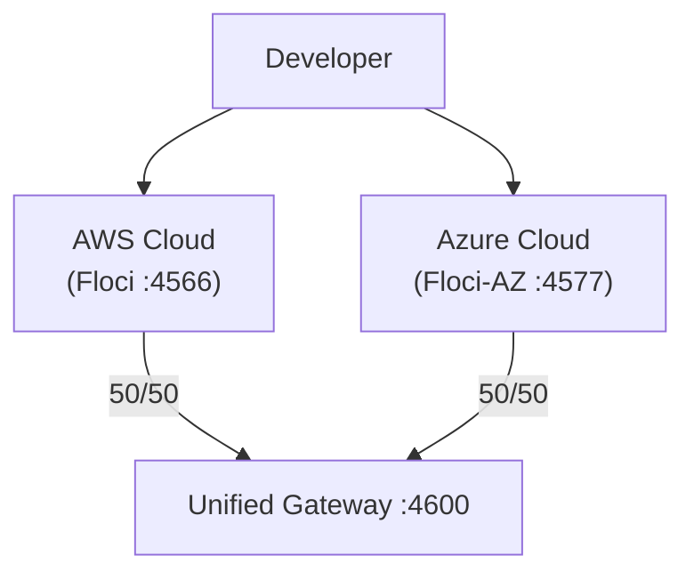

# Plan — Multi-Cloud Azure avec Floci-AZ

## Objectif

Replication complète de l'infrastructure AWS dans Azure via Floci-AZ, avec un gateway unifié au sommet répartissant 50/50 le trafic entre les deux clouds.

## Architecture cible

## Mapping des services

| AWS | Azure (Floci-AZ) | Module OpenTofu |
|-----|-------------------|-----------------|
| DynamoDB | Cosmos DB (NoSQL) | `az-cosmosdb` |
| S3 | Blob Storage | `az-storage` |
| Lambda | Azure Functions | `az-functions` |
| API Gateway | API Management | `az-apim` |
| SQS | Queue Storage | `az-storage-queue` |
| SNS | Event Grid | `az-eventgrid` |
| EventBridge | Event Grid | `az-eventgrid` |
| CloudWatch | Azure Monitor | `az-monitor` |
| KMS | Key Vault | `az-keyvault` |
| IAM | Entra ID | `az-entra` |

## Étapes

### Phase 1 — Fondations Azure

1. Ajouter Floci-AZ au `docker-compose.yml`
2. Créer l'environnement `infrastructure/environments/dev-az/`
3. Configurer le provider `azurerm` avec endpoint local
4. Créer les modules OpenTofu de base :
   - `infrastructure/modules/az-cosmosdb/`
   - `infrastructure/modules/az-storage/`
   - `infrastructure/modules/az-keyvault/`

### Phase 2 — Compute & API

5. Créer les modules :
   - `infrastructure/modules/az-functions/`
   - `infrastructure/modules/az-apim/`
6. Déployer les équivalents Azure des Lambda handlers
7. Configurer les routes API Azure (users, projects, artifacts)

### Phase 3 — Messaging & Events

8. Créer les modules :
   - `infrastructure/modules/az-storage-queue/`
   - `infrastructure/modules/az-eventgrid/`
9. Implémenter le dispatcher Azure (Event Grid → Queue → Worker)
10. Configurer le worker Azure (Queue → Blob Storage)

### Phase 4 — Observabilité & Sécurité

11. Créer les modules :
    - `infrastructure/modules/az-monitor/`
    - `infrastructure/modules/az-entra/`
12. Configurer Azure Monitor pour les logs et métriques
13. Appliquer les politiques Key Vault pour le chiffrement

### Phase 5 — Gateway Unifié

14. Configurer le gateway nginx (config + service docker-compose, pas un module
    OpenTofu : le gateway est un proxy local, pas une ressource cloud)
15. Implémenter le load balancer nginx 50/50 :
    - `X-Cloud: aws` → Floci (:4566)
    - `X-Cloud: azure` → Floci-AZ (:4577)
    - Pas de header → split aléatoire 50/50
16. Exposer sur `:4600`

### Phase 6 — CI/CD

17. ✅ Ajouter le job CI pour la validation Azure — `multicloud` job
    (fmt, init, validate, plan sur dev-az)
18. ⚠️ Tests d'intégration Azure **non implémentés** — le `apply` Azure est
    bloqué (Floci-AZ n'émule pas `Microsoft.Web/serverfarms`), donc pas de
    workload à tester. Documenté dans
    `docs/02-infrastructure/multicloud-journal.md`.
19. ✅ Pipeline avec les deux clouds — le `multicloud` job valide l'IaC Azure
    jusqu'au `plan` (pas d'`apply`/`destroy` pour le moment).
    Le gateway route tout le trafic vers Floci (AWS).

### Phase 7 — Documentation & Nettoyage

20. Créer ADR-006 (topologie multi-cloud AWS+Azure)
21. Mettre à jour tous les fichiers `.md`
22. Ajouter les runbooks Azure
