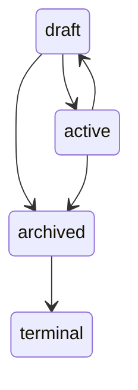
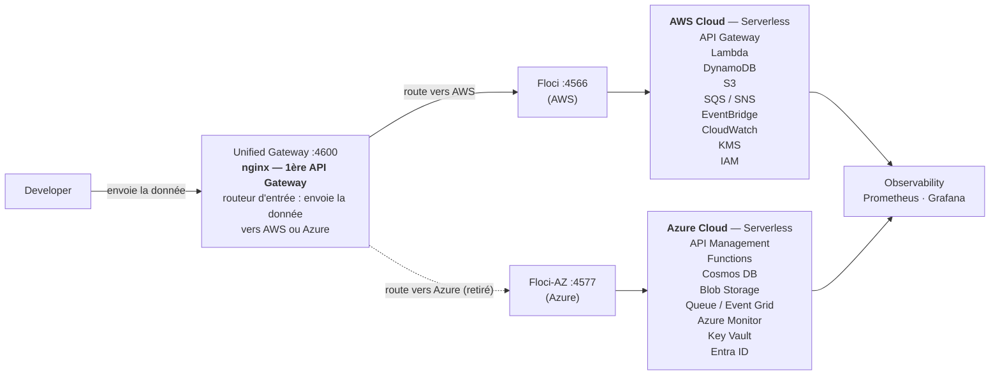
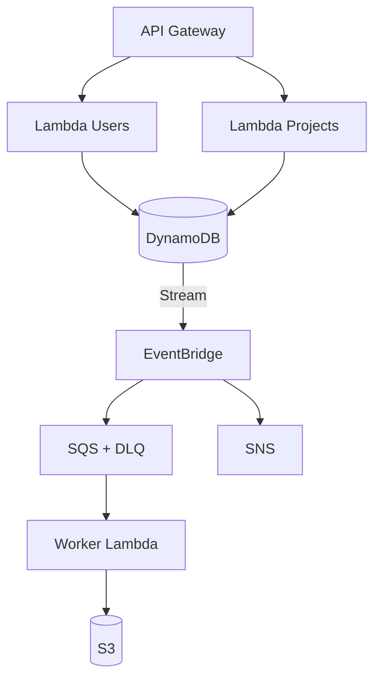

# CloudForge

> **Production-grade DevOps laboratory built on local AWS and Azure environments with Floci, Floci-AZ, OpenTofu and Docker.**

CloudForge reproduces a realistic **multi-cloud** production environment locally — no real AWS or Azure account required. It combines **Infrastructure as Code, CI/CD, security scanning, containerization, event-driven architecture and observability** to demonstrate the engineering workflow surrounding a production cloud platform.

The infrastructure is provisioned with **OpenTofu** against **Floci** (local AWS emulator) and **Floci-AZ** (local Azure emulator), behind a **unified gateway** (currently routing to AWS). A single CI pipeline validates infrastructure, scans security and runs automated tests.

---

## Key Features

* **Local AWS simulation** — Floci provides AWS-compatible APIs on `localhost:4566`
* **Local Azure simulation** — Floci-AZ provides Azure-compatible APIs on `localhost:4577`
* **Unified cloud gateway** — a single nginx gateway on `localhost:4600` (routes to AWS; multi-cloud split deferred pending Floci-AZ support)
* **Infrastructure as Code** — declarative, reusable OpenTofu modules per cloud service
* **Event-driven architecture** — API Gateway → Lambda → DynamoDB → Streams → EventBridge → SQS/SNS → S3 (AWS) mirrored by API Management → Functions → Cosmos DB → Event Grid → Queue → Blob (Azure)
* **Web console** — browser UI for the domain served by nginx with a same-origin API proxy
* **CI pipeline** — one GitHub Actions workflow covering lint, tests, IaC validation, integration tests and multi-cloud validation
* **DevSecOps** — Trivy scans for vulnerabilities, misconfigurations and secrets at every change
* **Reliability engineering** — controlled failure scenarios, DLQs, alarms and incident documentation

---

## Business Domain

Underneath the platform engineering, CloudForge runs a small but realistic application domain: **users own projects, and projects carry artifacts**.

| Entity | Business rules |
| ------ | -------------- |
| **User** | Created with `name` + `email`; emails are unique (`409` on duplicates); full updates via PUT |
| **Project** | Must reference an existing user as `owner` (`400` otherwise); follows a strict lifecycle below |
| **Artifact** | Uploaded to a project as `filename` + `content_base64`; payload validated and size-capped; stored in S3 under `projects/{id}/` |

Projects move through an enforced state machine — an archived project never reopens:



Every write to users or projects flows through the event pipeline shown in the architecture diagram: a dispatcher turns each DynamoDB stream record into a domain event, and a worker persists an **immutable, timestamped trace** of every change in S3. Failed jobs retry three times, then land in a dead-letter queue that raises an alert.

Cross-cutting rules apply everywhere: every endpoint requires Bearer authentication, and all errors share one normalized `{error, message}` shape with consistent status codes.

The application logic lives in `lambdas/` (handlers plus shared `common/` modules for auth, lifecycle and responses) and is exercised by unit tests without any AWS dependency.

---

## Architecture



**Cloud A**: AWS (Floci) — serverless application platform.
**Cloud B**: Azure (Floci-AZ) — replicated serverless application platform.
**Unified gateway**: nginx on `:4600` currently routes **all** traffic to AWS. The 50/50 split and `X-Cloud` pinning are deferred pending Floci-AZ Function App support (see `docs/02-infrastructure/multicloud-journal.md`).

### Gateway routing

The gateway on `:4600` currently sends **all** requests to the AWS backend
(Floci). The `X-Cloud` header and the 50/50 split were removed pending
Floci-AZ Function App support; see `docs/02-infrastructure/multicloud-journal.md`.

```bash
curl http://localhost:4600/_localstack/health   # routes to Floci (AWS)
```

### Internal event-driven flow (AWS primary)



---

## Technology Stack

| Category      | Tools                                                              |
| ------------- | ------------------------------------------------------------------ |
| Infrastructure| [Floci](https://github.com/floci-io/floci), [Floci-AZ](https://github.com/floci-io/floci-az), [OpenTofu](https://opentofu.org/), Docker Compose |
| Gateway | nginx (unified cloud gateway on `:4600`) |
| Application   | Python, boto3, Lambda, Azure SDK, Functions, REST API              |
| DevOps        | Git, GitHub Actions                                                |
| Security      | Trivy (filesystem, IaC, secrets, dependencies)                     |
| Testing       | Pytest, `tofu fmt` / `validate` / `plan`, integration & e2e tests  |

---

## Quick Start

### Prerequisites

| Tool | Version tested | Notes |
| ---- | -------------- | ----- |
| Docker + Compose v2 | 29.x | runs Floci, Floci-AZ, gateway, observability stack and the web console |
| OpenTofu | 1.12.6 | pinned in CI; `opentofu` package or [opentofu.org](https://opentofu.org/docs/intro/install/) |
| Python | 3.13+ (3.14 works) | unit tests only; Lambda runtime itself is the `python:3.13` image |
| AWS CLI v2 | any | teardown (`aws s3 rm`) and ad-hoc AWS debugging |
| Trivy | 0.73.0 | security gates; [install guide](https://trivy.dev/latest/getting-started/installation/) |
| Git | any | |

Python test dependencies are pinned in `requirements-dev.txt` — install them
in a virtual environment (PEP 668: system installs are blocked on modern
distros and the Makefile never mutates your interpreter):

```bash
python3 -m venv .venv && source .venv/bin/activate
pip install -r requirements-dev.txt
```

### Launch

```bash
# 1. Start the local environment (Floci + Floci-AZ)
docker compose up -d

# 2. Initialize and validate OpenTofu (AWS)
cd infrastructure/environments/dev
tofu init && tofu fmt -check && tofu validate

# 3. Review the plan, then deploy
tofu plan
tofu apply

# 4. Run tests and security scan (from repository root)
pytest
make security

# 5. Open the web console (users, projects, artifacts)
docker compose up -d webapp && make ui-url
```

Full setup guide: [docs/04-devops/getting-started.md](docs/04-devops/getting-started.md)

Cleanup:

```bash
aws s3 rm s3://cloudforge-dev-artifacts --recursive   # the emulator refuses to delete non-empty buckets
tofu -chdir=infrastructure/environments/dev destroy    # primary (AWS/Floci)
tofu -chdir=infrastructure/environments/dev-az destroy # secondary (Azure/Floci-AZ)
docker compose down
```

---

## Repository Structure

```text
cloudforge/
│
├── .github/workflows/ci.yml   # Single CI workflow
├── lambdas/                   # Lambda handlers (users, projects, worker)
├── infrastructure/
│   ├── modules/               # Reusable OpenTofu modules (AWS + Azure)
│   ├── environments/          # dev / staging / prod / dev-az
│   └── proxy/                 # Unified cloud gateway (nginx)
├── tests/                       # unit / integration / e2e
├── webapp/                      # browser console (vanilla JS + nginx proxy)
├── docker/                      # Container assets
├── rules/                     # Mandatory project constraints (agents)
├── skills/                    # Project-specific procedures (agents)
├── docs/                      # Project knowledge base
├── docker-compose.yml         # Local Floci + Floci-AZ environment
└── Makefile                   # Common developer commands
```

---

## Documentation

| Document | Content |
| -------- | ------- |
| [Architecture overview](docs/01-architecture/overview.md) | Goals and multi-cloud design |
| [Cloud services](docs/01-architecture/aws-services.md) | AWS + Azure services and their purpose |
| [ADRs](docs/01-architecture/decisions/README.md) | Architecture decision records |
| [OpenTofu](docs/02-infrastructure/opentofu.md) | Modules, environments, workflow |
| [Local environment](docs/02-infrastructure/local-environment.md) | Floci + Floci-AZ usage |
| [Getting started](docs/04-devops/getting-started.md) | Full setup guide |
| [CI pipeline](docs/04-devops/ci.md) | Pipeline stages and principles |
| [Security principles](docs/05-security/principles.md) | DevSecOps practices |
| [Failure scenarios](docs/07-reliability/failure-scenarios.md) | Reliability engineering |
| [Observability](docs/07-reliability/observability.md) | Logs, metrics, alarms |
| [Roadmap](docs/08-roadmap/roadmap.md) | Phases and backlog |
| [Plan](PLAN.md) | Multi-cloud Azure replication plan |

For AI agents working on this repository, start with [AGENTS.md](AGENTS.md).

---

## Why CloudForge?

CloudForge is intentionally more than an AWS demo project.

It demonstrates how a **multi-cloud** platform can be **provisioned, tested, secured, deployed, monitored, operated — and recovered from failures**, using local tooling that mirrors production workflows.

The architecture is designed to evolve from a local development environment toward a realistic production deployment model.

## License

This project is intended for educational and portfolio purposes.

License: MIT
