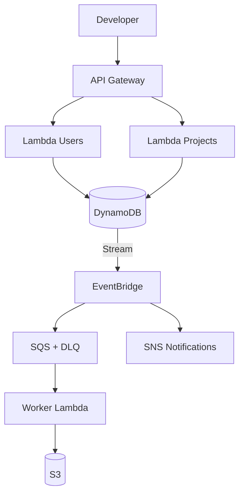
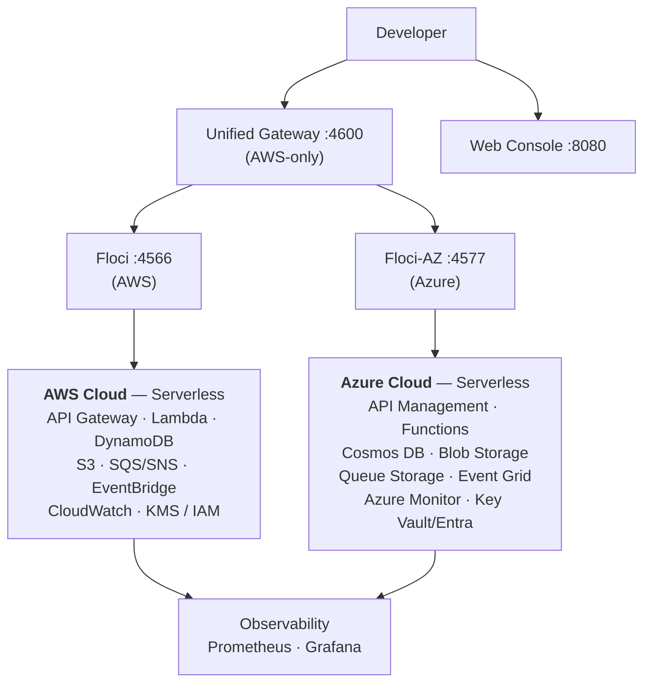

# Architecture Overview

CloudForge is a multi-cloud DevOps laboratory that reproduces a realistic AWS production environment locally, alongside an Azure replica — no real AWS or Azure account required.

## Project Goals

CloudForge is designed around six main objectives:

* Build a realistic **multi-cloud architecture** (AWS + Azure, replicated serverless platform)
* Manage infrastructure entirely with **OpenTofu** across both clouds
* Implement a complete **CI pipeline** (single workflow, five jobs)
* Integrate **DevSecOps practices with Trivy**
* Test AWS infrastructure locally using **Floci** and Azure using **Floci-AZ**
* Provide a **unified cloud gateway** routing traffic (currently AWS-only; see
  `02-infrastructure/multicloud-journal.md`)

The goal is not simply to deploy an application.

The goal is to reproduce the **engineering workflow surrounding a production cloud platform**.

## Event-Driven Architecture

## Multi-Cloud Architecture

## Why CloudForge?

CloudForge is intentionally more than an AWS demo project.

It is a **DevOps laboratory** designed to demonstrate how a cloud platform can be:

* provisioned across multiple clouds
* tested
* secured
* deployed
* monitored
* operated
* and recovered from failures

The project uses Floci to reproduce AWS locally, Floci-AZ to reproduce Azure locally, OpenTofu to manage infrastructure declaratively across both, a unified nginx gateway to route traffic (currently all to Floci/AWS), and Trivy to introduce security directly into the development lifecycle. The gateway's 50/50 multi-cloud routing is deferred pending Floci-AZ Function App support (see `02-infrastructure/multicloud-journal.md`).

The architecture is designed to evolve from a local development environment toward a realistic production deployment model.
