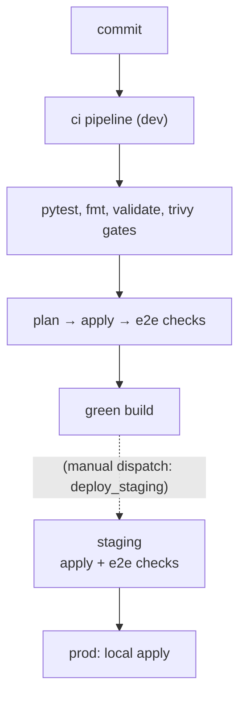

# Deployment Strategy

How changes travel from a commit to the running environments, and how to get
back out of a bad deployment. The topology is defined in
[ADR-004](../01-architecture/decisions/ADR-004-environment-topology.md).

## Environments

| Environment | Directory | Cloud | Lifetime | Deployed by |
| ----------- | --------- | ----- | -------- | ----------- |
| dev | `infrastructure/environments/dev` | AWS (Floci) | ephemeral | CI on every push/PR; `make apply` locally |
| staging | `infrastructure/environments/staging` | AWS (Floci) | long-lived | CI manual dispatch (promotion) or local apply |
| prod | `infrastructure/environments/prod` | AWS (Floci) | long-lived | explicit local apply only |
| dev-az | `infrastructure/environments/dev-az` | Azure (Floci-AZ) | ephemeral | CI validates to `plan` only (`make apply` blocked — see multicloud-journal) |

The AWS environments all wrap the same platform module, so behavior
differences come from inputs only — never from drifted code.

The Azure environment models a warm-standby DR site on a second cloud
provider (ADR-005). It provisions VPC, private network, a standby instance
and a block volume through the real `azurerm` provider against the
Floci-AZ emulator. When Floci goes down, the application runs as Docker
containers on the Azure instance (Phases 11-12).

## Deployment flow



* Dev is destroyed and rebuilt every run — the pipeline itself is the DR drill.
* Staging promotion reuses the exact packages validated in dev.
* Prod is never touched by automation; applying it is a deliberate operator act.
* The Azure DR environment is no longer validated in CI; multi-cloud routing and the Azure validation gate were removed from the pipeline (see `docs/02-infrastructure/multicloud-journal.md`).

## Rollback strategy

OpenTofu state only moves forward, so rollback means **redeploying an earlier
build**, not reversing state:

1. Identify the last known-good git revision (`git log --oneline`).
2. Check it out and rebuild packages:

   ```bash
   git checkout <good-rev>
   make package
   ```

3. Redeploy the target environment:

   ```bash
   tofu -chdir=infrastructure/environments/<env> apply -auto-approve
   ```

Infrastructure-only regressions can alternatively be rolled back with a plan
against the previous configuration directory state (`tofu apply` of the older
code), which is the same mechanism: old code, fresh apply.

## Disaster recovery scenario

Two recovery paths exist depending on what failed:

### Path A — Floci corrupted (primary rebuild)

Scenario: the Floci emulator state is corrupted or lost (bad apply, emulator
state loss, host reboot with storage wipe).

Procedure (runbook RB-03):

```bash
docker compose down && docker compose up -d   # fresh emulator + observability stack
make apply AUTO_APPROVE=true                  # rebuild infrastructure from code
make test-integration                         # prove the platform end to end
```

Expected recovery time: under ten minutes for one environment (CI completes the
same path unattended). Expected data loss: everything created after the last
apply — accepted for the lab, documented here because the same decision must be
explicit in production.

### Path B — Floci lost (failover to Azure)

> **Blocked.** Azure failover is not currently exercisable. Azure Functions
> cannot be provisioned (Floci-AZ lacks `Microsoft.Web/serverfarms`), so the
> `apply` of `dev-az` cannot complete and there is no running Azure workload.
> The gateway routes all traffic to Floci (AWS). When Floci is lost, the
> application is unreachable until Floci returns. See
> `docs/02-infrastructure/multicloud-journal.md`.

Scenario: the primary cloud is unavailable or corrupted beyond rebuild. The
application would fail over to an Azure DR site. This requires the Azure replica
to become deployable first (Floci-AZ Function App support), then re-provision
the Azure stack, restore a two-backend gateway, and only then can the failover
procedure be re-established.

## Known constraints

* Floci multi-account isolation is control-plane only; environments therefore
  share the default account and rely on name prefixes.
* Floci-AZ is control-plane only in its default mode; Azure instances do not
  boot natively. The DR site runs Docker containers via `user_data` scripts
  to work around this limitation (Phases 11-12).
* Floci-AZ does not emulate Blob Storage; artifacts are replicated to the
  block volume filesystem instead of Blob Storage.
* Volume attachment drift: Floci-AZ does not persist attachment state; every plan
  re-applies `additional_volume_ids` (idempotent, harmless).
* Stream event source mappings are recreated fresh on cold rebuilds, so no
  stream history replays into a new environment.
