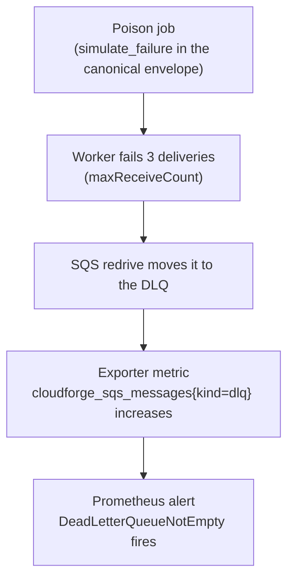
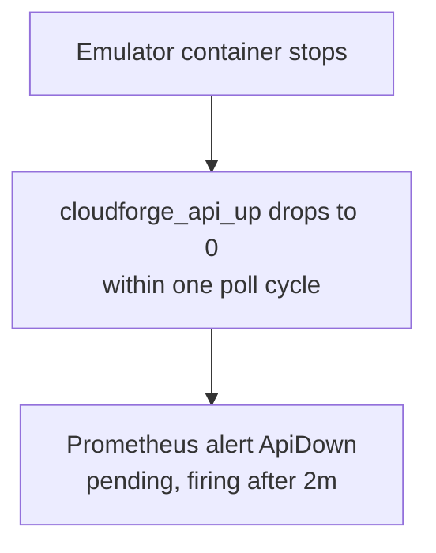
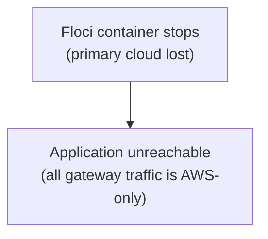

# Reliability — Failure Scenarios

CloudForge is also designed as an SRE/DevOps laboratory.

The project includes controlled failure scenarios to demonstrate operational maturity, not only deployment skills. Both scenarios below are reproducible with one command against the live environment.

## Scenario 1 — poison job → retries → DLQ → alert

Reproduce: `make inject-poison`. Full lifecycle documented in
[INC-001](incidents/INC-001-poison-job-to-dlq.md).

## Scenario 2 — emulator outage → health probe → alert

Reproduce: `make inject-outage` (stops the emulator for ~150 s and restarts it).
Full lifecycle documented in [INC-002](incidents/INC-002-emulator-outage.md).

## Scenario 3 — Azure failover (Floci down → Azure site active)

> **Status: blocked — not currently exercisable.** Azure Functions cannot be
> provisioned (Floci-AZ lacks `Microsoft.Web/serverfarms`), so there is no
> running Azure workload to fail over to. See
> [multicloud-journal.md](../02-infrastructure/multicloud-journal.md). The
> gateway routes all traffic to Floci (AWS), so when Floci is down the
> application is unreachable.

This warm-standby scenario depends on the Azure replica becoming deployable,
which is blocked pending Floci-AZ Function App support. When resolved, restore
the two-backend gateway (50/50 or `X-Cloud` pinning) and re-provision the
Azure stack before re-enabling this scenario.

## Incident documentation

Each incident report follows the same eight-part lifecycle:

1. Detection
2. Impact
3. Investigation
4. Root cause
5. Remediation
6. Recovery
7. Prevention
8. Post-mortem

See `skills/incident-response/SKILL.md` for the procedure,
[runbooks](runbooks.md) for operations, and [observability](observability.md)
for detection signals.
